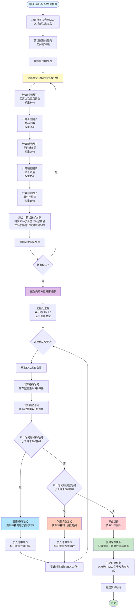
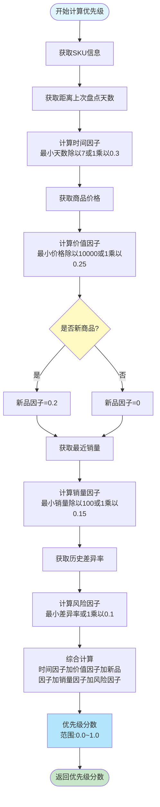
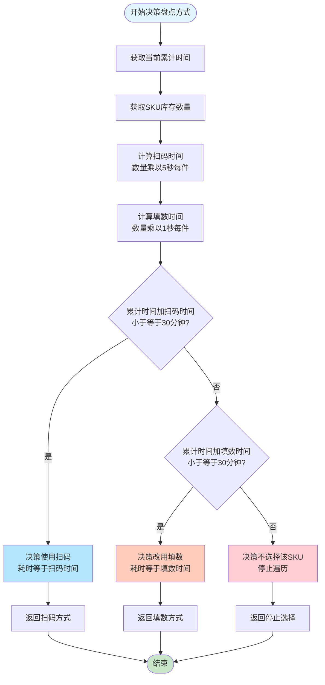
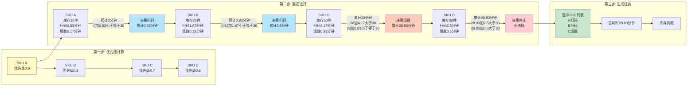
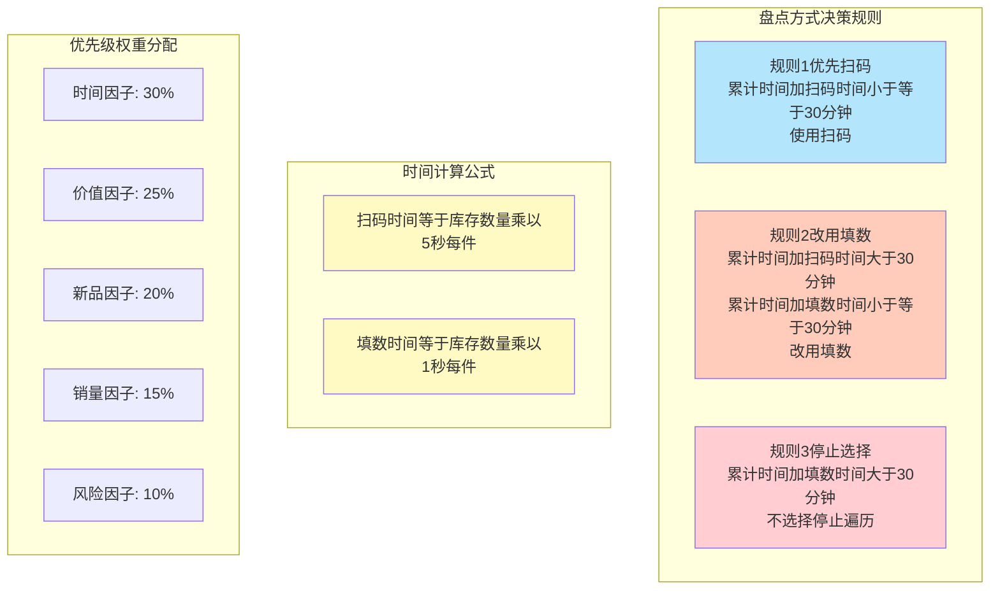

# SKU轮换算法流程图（Mermaid格式）

## 完整算法流程图

```mermaid
graph TB
    Start([开始: 每日04:00生成任务]) --> GetSKU[获取所有未盘点SKU<br/>包括新入库商品]
    GetSKU --> FilterCategory[筛选配置的品类<br/>仅手机/平板]
    FilterCategory --> InitList[初始化SKU列表]
    
    InitList --> CalcPriority[计算每个SKU的优先级分数]
    
    CalcPriority --> CalcTime[计算时间因子<br/>距离上次盘点天数<br/>权重30%]
    CalcTime --> CalcValue[计算价值因子<br/>商品价格<br/>权重25%]
    CalcValue --> CalcNew[计算新品因子<br/>是否新商品<br/>权重20%]
    CalcNew --> CalcSales[计算销量因子<br/>最近销量<br/>权重15%]
    CalcSales --> CalcRisk[计算风险因子<br/>历史差异率<br/>权重10%]
    
    CalcRisk --> SumScore[综合计算优先级分数<br/>时间30%加价值25%加新品20%加销量15%加风险10%]
    SumScore --> AddToPriorityList[添加到优先级列表]
    AddToPriorityList --> CheckMore{还有SKU?}
    CheckMore -->|是| CalcPriority
    CheckMore -->|否| SortByPriority[按优先级分数降序排序]
    
    SortByPriority --> InitSelect[初始化选择<br/>累计时间等于0<br/>选中列表为空]
    
    InitSelect --> SelectLoop{遍历优先级列表}
    SelectLoop --> GetStockQty[获取SKU库存数量]
    GetStockQty --> CalcScanTime[计算扫码时间<br/>库存数量乘以5秒每件]
    CalcScanTime --> CalcFillTime[计算填数时间<br/>库存数量乘以1秒每件]
    
    CalcFillTime --> CheckScanTime{累计时间加扫码时间<br/>小于等于30分钟?}
    
    CheckScanTime -->|是| UseScan[使用扫码方式<br/>该SKU耗时等于扫码时间]
    CheckScanTime -->|否| CheckFillTime{累计时间加填数时间<br/>小于等于30分钟?}
    
    CheckFillTime -->|是| UseFill[改用填数方式<br/>该SKU耗时=填数时间]
    CheckFillTime -->|否| StopSelect[停止选择<br/>该SKU不加入]
    
    UseScan --> AddToSelected[加入选中列表<br/>标记盘点方式扫码]
    UseFill --> AddToSelected2[加入选中列表<br/>标记盘点方式填数]
    
    AddToSelected --> UpdateTime[累计时间增加该SKU耗时]
    AddToSelected2 --> UpdateTime
    
    UpdateTime --> SelectLoop
    StopSelect --> CreateSnapshot[创建库存快照<br/>记录盘点开始时的库存状态]
    
    CreateSnapshot --> GenTask[生成日盘任务<br/>包含选中SKU列表及盘点方式]
    GenTask --> PushTask[推送到移动端]
    PushTask --> End([结束])
    
    style Start fill:#e1f5ff
    style End fill:#c8e6c9
    style CalcPriority fill:#fff9c4
    style SortByPriority fill:#e1bee7
    style UseScan fill:#b3e5fc
    style UseFill fill:#ffccbc
    style StopSelect fill:#ffcdd2
    style CreateSnapshot fill:#c8e6c9
```

## 优先级计算详细流程

```mermaid
graph TB
    Start([开始计算优先级]) --> GetSKUInfo[获取SKU信息]
    GetSKUInfo --> GetDays[获取距离上次盘点天数]
    GetDays --> CalcTimeFactor[计算时间因子<br/>最小天数除以7或1乘以0.3]
    
    CalcTimeFactor --> GetPrice[获取商品价格]
    GetPrice --> CalcValueFactor[计算价值因子<br/>最小价格除以10000或1乘以0.25]
    
    CalcValueFactor --> CheckNew{是否新商品?}
    CheckNew -->|是| NewFactor1[新品因子=0.2]
    CheckNew -->|否| NewFactor2[新品因子=0]
    
    NewFactor1 --> GetSales
    NewFactor2 --> GetSales
    
    GetSales[获取最近销量] --> CalcSalesFactor[计算销量因子<br/>最小销量除以100或1乘以0.15]
    
    CalcSalesFactor --> GetVariance[获取历史差异率]
    GetVariance --> CalcRiskFactor[计算风险因子<br/>最小差异率或1乘以0.1]
    
    CalcRiskFactor --> SumAll[综合计算<br/>时间因子加价值因子加新品因子加销量因子加风险因子]
    SumAll --> PriorityScore[优先级分数<br/>范围:0.0~1.0]
    PriorityScore --> End([返回优先级分数])
    
    style Start fill:#e1f5ff
    style End fill:#c8e6c9
    style CheckNew fill:#fff9c4
    style PriorityScore fill:#b3e5fc
```

## 盘点方式决策流程

```mermaid
graph TB
    Start([开始决策盘点方式]) --> GetCurrentTime[获取当前累计时间]
    GetCurrentTime --> GetStockQty[获取SKU库存数量]
    GetStockQty --> CalcScan[计算扫码时间<br/>数量乘以5秒每件]
    CalcScan --> CalcFill[计算填数时间<br/>数量乘以1秒每件]
    
    CalcFill --> CheckScan{累计时间加扫码时间<br/>小于等于30分钟?}
    
    CheckScan -->|是| Decision1[决策使用扫码<br/>耗时等于扫码时间]
    CheckScan -->|否| CheckFill{累计时间加填数时间<br/>小于等于30分钟?}
    
    CheckFill -->|是| Decision2[决策改用填数<br/>耗时等于填数时间]
    CheckFill -->|否| Decision3[决策不选择该SKU<br/>停止遍历]
    
    Decision1 --> ReturnScan[返回扫码方式]
    Decision2 --> ReturnFill[返回填数方式]
    Decision3 --> ReturnStop[返回停止选择]
    
    ReturnScan --> End([结束])
    ReturnFill --> End
    ReturnStop --> End
    
    style Start fill:#e1f5ff
    style End fill:#c8e6c9
    style Decision1 fill:#b3e5fc
    style Decision2 fill:#ffccbc
    style Decision3 fill:#ffcdd2
```

## 完整选择流程示例

```mermaid
graph LR
    subgraph 优先级计算["第一步: 优先级计算"]
        P1[SKU A<br/>优先级0.9] --> P2[SKU B<br/>优先级0.8]
        P2 --> P3[SKU C<br/>优先级0.7]
        P3 --> P4[SKU D<br/>优先级0.6]
    end
    
    subgraph 遍历选择["第二步: 遍历选择"]
        S1[SKU A<br/>库存10件<br/>扫码0.83分钟<br/>填数0.17分钟] -->|累计0分钟<br/>0加0.83小于等于30| D1[决策扫码<br/>累计0.83分钟]
        D1 --> S2[SKU B<br/>库存20件<br/>扫码1.67分钟<br/>填数0.33分钟]
        S2 -->|累计0.83分钟<br/>0.83加1.67小于等于30| D2[决策扫码<br/>累计2.5分钟]
        D2 --> S3[SKU C<br/>库存50件<br/>扫码4.17分钟<br/>填数0.83分钟]
        S3 -->|累计28分钟<br/>28加4.17大于30<br/>28加0.83小于等于30| D3[决策填数<br/>累计28.83分钟]
        D3 --> S4[SKU D<br/>库存30件<br/>扫码2.5分钟<br/>填数0.5分钟]
        S4 -->|累计28.83分钟<br/>28.83加2.5大于30<br/>28.83加0.5大于30| D4[决策停止<br/>不选择]
    end
    
    subgraph 结果输出["第三步: 生成任务"]
        R1[选中SKU列表<br/>A扫码<br/>B扫码<br/>C填数]
        R2[总耗时28.83分钟]
        R3[库存快照]
    end
    
    P1 --> S1
    D4 --> R1
    R1 --> R2
    R2 --> R3
    
    style P1 fill:#fff9c4
    style D1 fill:#b3e5fc
    style D2 fill:#b3e5fc
    style D3 fill:#ffccbc
    style D4 fill:#ffcdd2
    style R1 fill:#c8e6c9
```

## 关键决策表

```mermaid
graph TB
    subgraph 决策规则["盘点方式决策规则"]
        Rule1[规则1优先扫码<br/>累计时间加扫码时间小于等于30分钟<br/>使用扫码]
        Rule2[规则2改用填数<br/>累计时间加扫码时间大于30分钟<br/>累计时间加填数时间小于等于30分钟<br/>改用填数]
        Rule3[规则3停止选择<br/>累计时间加填数时间大于30分钟<br/>不选择停止遍历]
    end
    
    subgraph 时间计算["时间计算公式"]
        Time1[扫码时间等于库存数量乘以5秒每件]
        Time2[填数时间等于库存数量乘以1秒每件]
    end
    
    subgraph 优先级权重["优先级权重分配"]
        Weight1[时间因子: 30%]
        Weight2[价值因子: 25%]
        Weight3[新品因子: 20%]
        Weight4[销量因子: 15%]
        Weight5[风险因子: 10%]
    end
    
    style Rule1 fill:#b3e5fc
    style Rule2 fill:#ffccbc
    style Rule3 fill:#ffcdd2
    style Time1 fill:#fff9c4
    style Time2 fill:#fff9c4
```
