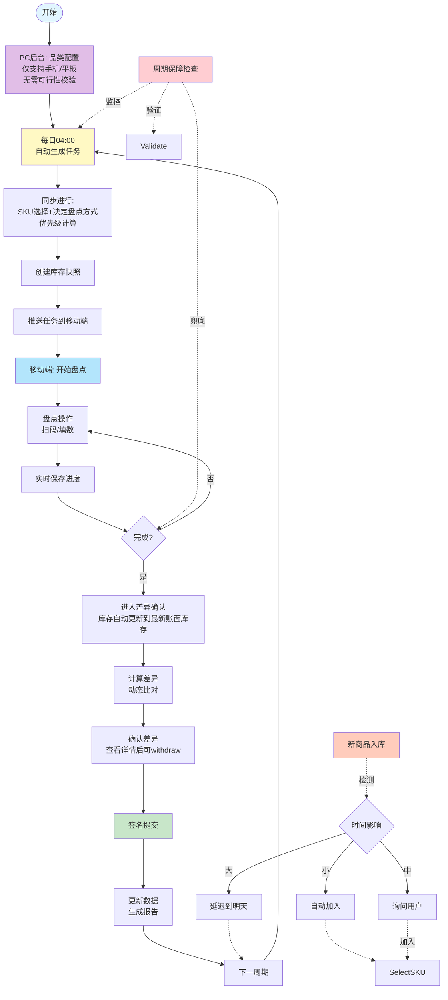
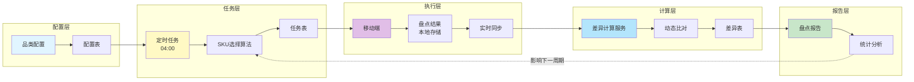
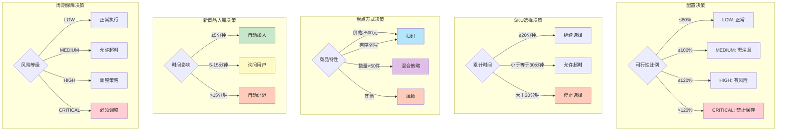

# 日盘系统主流程图（Mermaid格式）

## 完整业务主流程

```mermaid
graph TB
    subgraph PC后台["PC后台 - 配置管理"]
        A1[品类配置<br/>仅支持手机/平板] --> A3[保存配置<br/>无需可行性校验]
        A3 --> A5[创建盘点计划<br/>可选]
    end
    
    subgraph 任务生成["系统 - 任务生成<br/>每日04:00"]
        B1[获取未盘点SKU] --> B2[计算优先级<br/>时间/价值/销量/新品/风险]
        B2 --> B3[同步进行:<br/>选择当日SKU加决定盘点方式<br/>控制时间20到30分钟]
        B3 --> B4{盘点方式}
        B4 -->|高价值/有序列号| B5[扫码]
        B4 -->|其他| B7[填数]
        B5 --> B8[创建库存快照]
        B7 --> B8
        B8 --> B9[生成任务<br/>推送到移动端]
    end
    
    subgraph 移动端盘点["移动端 - 盘点执行"]
        C1[查看任务] --> C3[显示操作说明]
        C3 --> C5[开始盘点]
        C5 --> C6{盘点方式}
        C6 -->|扫码| C7[扫描序列号]
        C6 -->|填数| C8[输入数量]
        C7 --> C10[实时保存进度]
        C8 --> C10
        C10 --> C11{所有SKU完成?}
        C11 -->|否| C6
        C11 -->|是| C12[完成盘点]
    end
    
    subgraph 差异确认["移动端 - 差异确认"]
        D1[进入确认页面<br/>库存自动更新到最新账面库存] --> D4[计算差异<br/>库存快照+动态比对]
        D4 --> D6[显示差异列表<br/>按SKU分组]
        D6 --> D7{所有差异已确认?}
        D7 -->|否| D8[查看详情]
        D8 --> D8A{原先是否<br/>多盘或少盘?}
        D8A -->|是| D8B[可以withdraw]
        D8A -->|否| D8C[填写差异原因]
        D8B --> D8C
        D8C --> D9[确认差异]
        D9 --> D7
        D7 -->|是| D11[进入签名]
    end
    
    subgraph 签名提交["移动端 - 签名提交"]
        E1[签名确认] --> E2[保存签名]
        E2 --> E3[确认提交]
        E3 --> E4[更新任务状态]
        E4 --> E5[更新SKU盘点时间]
        E5 --> E6[更新库存快照]
        E6 --> E7[生成盘点报告]
    end
    
    subgraph 周期保障["系统 - 周期保障机制"]
        F1[周期开始前验证] --> F2{可行性检查}
        F2 -->|不可行| F3[调整配置/延长周期]
        F2 -->|可行| F4[周期进行中监控]
        F4 --> F5{风险等级}
        F5 -->|LOW| F6[正常执行]
        F5 -->|MEDIUM| F7[提示注意]
        F5 -->|HIGH| F8[调整策略]
        F5 -->|CRITICAL| F9[必须调整]
        F6 --> F10{最后2天?}
        F7 --> F10
        F8 --> F10
        F9 --> F10
        F10 -->|是| F11[强制分配剩余SKU]
        F10 -->|否| F4
        F11 --> F12[确保重要SKU完成]
    end
    
    subgraph 新商品处理["系统 - 新商品入库处理"]
        G1[检测新商品入库] --> G2{在品类范围内?}
        G2 -->|否| G3[忽略]
        G2 -->|是| G4[计算时间成本]
        G4 --> G5{时间影响}
        G5 -->|≤5分钟| G6[自动加入<br/>Toast提示]
        G5 -->|5-15分钟| G7[弹窗询问用户]
        G5 -->|>15分钟| G8[自动延迟<br/>Banner提示]
        G6 --> G9[重新计算优先级]
        G7 --> G10{用户选择}
        G10 -->|加入| G9
        G10 -->|延迟| G11[安排到明日]
        G8 --> G11
        G9 --> G12[动态调整任务]
    end
    
    A5 --> B1
    B9 --> C1
    C12 --> D1
    D11 --> E1
    E7 --> F1
    B1 -.新商品.-> G1
    G12 -.影响.-> B1
    
    style A1 fill:#e1f5ff
    style B1 fill:#fff9c4
    style C1 fill:#e1bee7
    style D1 fill:#b3e5fc
    style E1 fill:#c8e6c9
    style F1 fill:#ffccbc
    style G1 fill:#fff9c4
```

## 简化版核心流程

## 数据流转图

## 关键决策点汇总

---

## 使用说明

1. **完整业务主流程**：展示了从配置到提交的完整流程，包括所有子流程
2. **简化版核心流程**：更简洁的视图，突出核心步骤
3. **数据流转图**：展示数据在各层之间的流转
4. **关键决策点汇总**：所有关键决策点的汇总视图

这些流程图可以直接在支持Mermaid的环境中查看和编辑。
