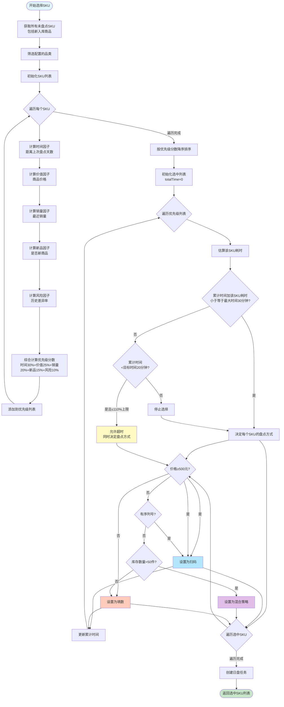
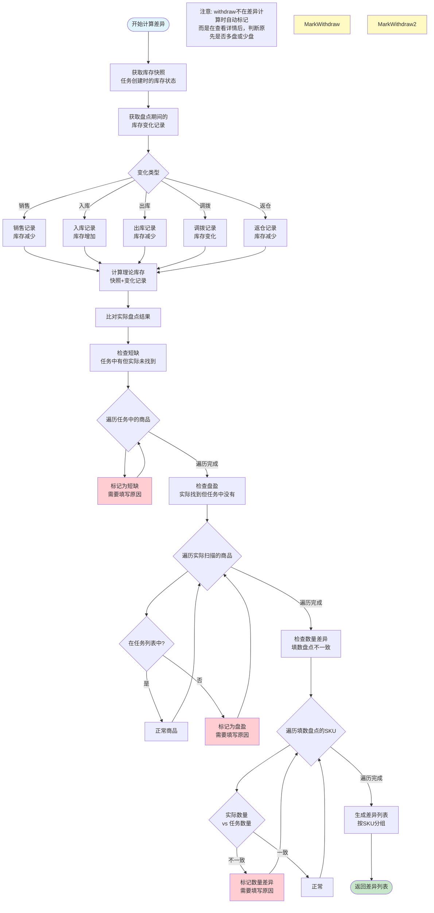
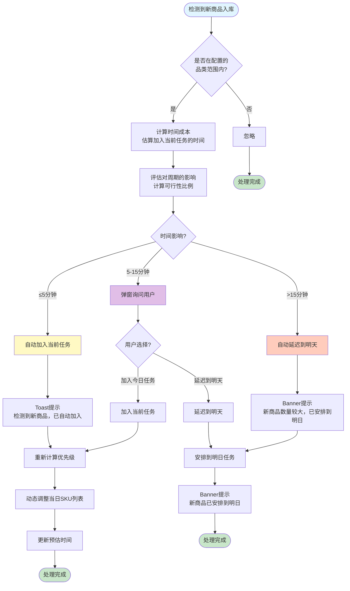
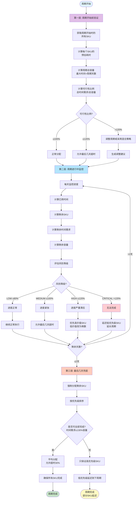
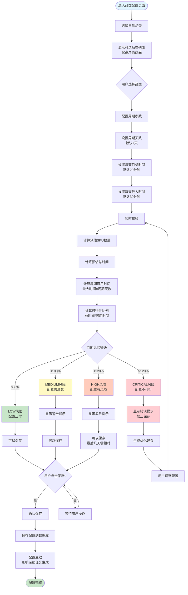
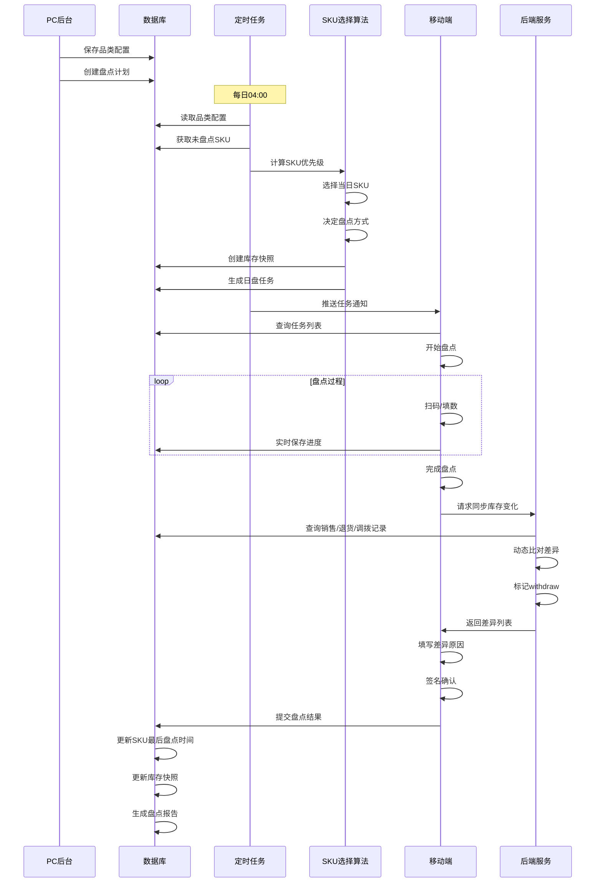

# 日盘系统流程图（Mermaid格式）

## 一、完整业务流程图

```mermaid
graph TB
    Start([开始]) --> Config[PC后台: 品类配置<br/>仅支持手机/平板]
    Config --> ConfigSave[保存配置<br/>无需可行性校验]
    ConfigSave --> PlanCreate[创建盘点计划<br/>可选]
    PlanCreate --> WaitTask[等待任务生成]
    
    WaitTask --> TaskGen[每日04:00<br/>自动生成任务]
    TaskGen --> GetSKU[获取未盘点SKU<br/>包含新入库商品]
    GetSKU --> CalcPriority[计算SKU优先级<br/>时间/价值/销量/新品/风险]
    CalcPriority --> SelectAndDecide[同步进行:<br/>选择当日SKU加决定盘点方式<br/>控制时间20到30分钟]
    SelectAndDecide --> CreateSnapshot[创建库存快照]
    CreateSnapshot --> PushTask[推送任务到移动端]
    
    PushTask --> MobileView[移动端: 查看任务]
    MobileView --> ShowInstruction[显示操作说明弹窗]
    ShowInstruction --> StartCount[开始盘点]
    
    StartCount --> CountMethod{盘点方式?}
    CountMethod -->|扫码| ScanMode[扫码盘点<br/>扫描序列号]
    CountMethod -->|填数| FillMode[填数盘点<br/>输入数量]
    
    ScanMode --> ScanResult{扫描结果?}
    ScanResult -->|正常| MoveToScanned[移到已盘点列表]
    ScanResult -->|重复| ShowDuplicate[提示重复]
    ScanResult -->|盘盈| RecordOverage[记录为盘盈]
    
    FillMode --> CalcDiff[计算数量差异]
    
    MoveToScanned --> SaveProgress[实时保存进度]
    ShowDuplicate --> SaveProgress
    RecordOverage --> SaveProgress
    CalcDiff --> SaveProgress
    
    SaveProgress --> CheckComplete{所有SKU<br/>盘点完成?}
    CheckComplete -->|否| CountMethod
    CheckComplete -->|是| FinishCount[完成盘点]
    
    FinishCount --> Reconciliation[进入差异确认<br/>库存自动更新到最新账面库存]
    Reconciliation --> CalcDiscrepancy[计算差异<br/>库存快照+动态比对]
    CalcDiscrepancy --> ShowDiffList[显示差异列表<br/>按SKU分组]
    
    ShowDiffList --> CheckDiff{所有差异<br/>已确认?}
    CheckDiff -->|否| ViewDetail[查看差异详情]
    ViewDetail --> CheckWithdraw{原先是否<br/>多盘或少盘?}
    CheckWithdraw -->|是| CanWithdraw[可以withdraw]
    CheckWithdraw -->|否| FillReason[填写差异原因<br/>上传凭证]
    CanWithdraw --> FillReason
    FillReason --> ConfirmDiff[确认差异]
    ConfirmDiff --> CheckDiff
    CheckDiff -->|是| Signature[进入签名环节]
    
    Signature --> SignArea[在签名区域签名]
    SignArea --> SaveSign[保存签名Base64]
    SaveSign --> Submit[确认提交]
    
    Submit --> UpdateStatus[更新任务状态<br/>COMPLETED]
    UpdateStatus --> UpdateSKU[更新SKU最后盘点时间]
    UpdateSKU --> UpdateSnapshot[更新库存快照]
    UpdateSnapshot --> GenReport[生成盘点报告]
    GenReport --> End([结束])
    
    style Start fill:#e1f5ff
    style End fill:#c8e6c9
    style TaskGen fill:#fff9c4
    style Reconciliation fill:#e1bee7
    style Signature fill:#b3e5fc
    style SelectAndDecide fill:#fff9c4
```

## 二、SKU选择算法流程图

## 三、差异计算流程图

## 四、新商品入库处理流程图

## 五、周期覆盖保障流程图

## 六、品类配置流程图

## 七、完整系统交互流程图

---

## 使用说明

以上流程图使用Mermaid格式编写，可以在以下环境中查看：

1. **GitHub/GitLab**: 直接支持Mermaid渲染
2. **VS Code**: 安装Mermaid Preview插件
3. **在线工具**: https://mermaid.live/
4. **Markdown编辑器**: Typora、Obsidian等

每个流程图都涵盖了日盘系统的关键环节，可以根据需要单独使用或组合使用。
